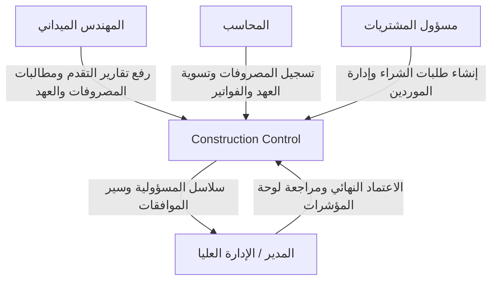

# معمارية النظام (System Architecture)

## 1. نظرة عامة (Overview)
نظام **Construction Control** هو طبقة إشراف وتحكم رقابية (Management Control Layer) لقطاع المقاولات، تهدف إلى توفير الشفافية الإدارية والرقابة على التدفقات المالية والميدانية.

---

## 2. المكونات المعمارية الأساسية

### 2.1 إطار العمل والتوجيه (Next.js App Router)
- تنظيم المسارات وفق مجموعات التوجيه (Route Groups):
  - `/(auth)`: صفحات المصادقة (تسجيل الدخول)
  - `/(manager)`: صفحات المدير ولوحة المؤشرات التنفيذية
  - `/(engineer)`: صفحات المهندس الميداني ومطالبات الموقع
  - `/(accountant)`: صفحات المحاسب والتسويات المالية
  - `/(purchasing)`: صفحات مسؤول المشتريات وطلبات الشراء
  - `/api`: نقاط نهاية الخادم ومسارات NextAuth

### 2.2 الأمان والتحكم في الوصول (RBAC)
- يعتمد النظام 4 أدوار حصرية: `MANAGER`, `ENGINEER`, `ACCOUNTANT`, `PURCHASING`.
- الفحص الأمني يتم دائماً في الخادم عبر:
  1. التحقق من وجود الجلسة وصلاحيتها (`requireAuth`).
  2. التحقق من حالة المستخدم النشطة (`user.isActive === true`).
  3. التحقق من الدور والصلاحية المحددة (`requireRole` / `policies`).

### 2.3 البيانات والمالية (Data & Financial Rules)
- **العملة**: الريال السعودي (SAR) حصراً.
- **الدقة**: استخدام نوع `Decimal` (15, 2) المعتمد في Prisma وتفادي الحسابات العائمة (Float).
- **السجلات المالية غير قابلة للتعديل**: بعد الاعتماد، لا تعديل في البيانات المالية؛ التعديل يتم عبر قيود تصحيحية عكسية.
- **الحذف الآمن**: تطبيق Soft Delete عبر حقل `deletedAt`.

---

## 3. طبقات الحماية والتحقق (Layered Protection)

1. **Next.js Middleware**: توجيه وحماية خشنة (Coarse-grained) على مستوى الروابط.
2. **Server Actions / API Handlers**: تحقق دقيق من الصلاحيات والمدخلات.
3. **Zod Validation**: فحص وتطهير كافة البيانات القادمة قبل استعلام قاعدة البيانات.
4. **Prisma ORM & PostgreSQL**: قيود ومحددات سلامة البيانات على مستوى قاعدة البيانات.
