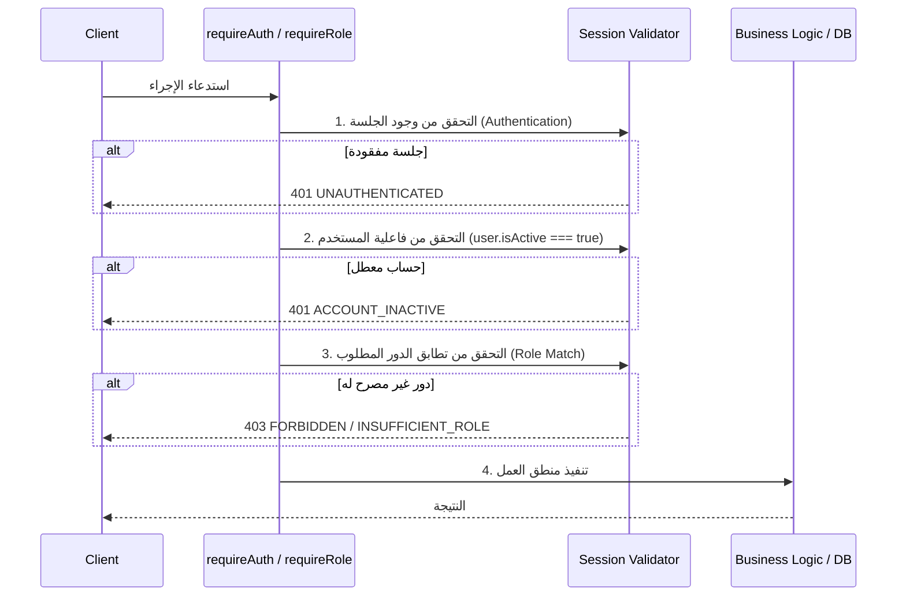

# نموذج التفويض والصلاحيات (Authorization Model)

## 1. المبادئ الأساسية (Core Principles)

1. **التحقق دائماً في جانب الخادم (Server-Side Enforcement)**:
   الفحص في جانب العميل هو لتحسين تجربة المستخدم فقط؛ القرارات الأمنية تُتخذ وتُنفذ حصراً في الخادم.
2. **عدم الوثوق بالعميل (Never Trust the Client)**:
   لا يتم الاعتماد على أي بيانات أو معرفات تأتي من العميل دون التحقق من هوية الجلسة المسجلة.
3. **مبدأ الامتياز الأقل (Least Privilege)**:
   كل دور يمتلك فقط الحد الأدنى من الصلاحيات اللازمة لأداء مهامه.
4. **الرفض افتراضياً (Deny by Default)**:
   أي إجراء لم يُمنح صراحةً يُعتبر محظوراً ومرفوضاً تلقائياً.

---

## 2. الأدوار الأربعة المعتمدة في v1 (Roles)

```prisma
enum Role {
  MANAGER     // المدير
  ENGINEER    // المهندس الميداني
  ACCOUNTANT  // المحاسب
  PURCHASING  // مسؤول المشتريات
}
```

### 2.1 مصفوفة الصلاحيات (Permission Matrix)

| العملية / الصلاحية | المدير (MANAGER) | المهندس (ENGINEER) | المحاسب (ACCOUNTANT) | المشتريات (PURCHASING) |
|---|:---:|:---:|:---:|:---:|
| اعتماد المصروفات والعهد | نعم | لا | لا | لا |
| رفع تقارير التقدم والمصروفات | لا (رقابي فقط) | نعم | لا | لا |
| تسوية العهد وتسجيل القيود | لا | لا | نعم | لا |
| إنشاء طلبات الشراء وأوامر الشراء | اعتماد فقط | لا | لا | نعم |
| إدارة المستخدمين والحسابات | نعم | لا | لا | لا |
| استعراض اللوحات التنفيذية | نعم | لا | لا | لا |

---

## 3. تسلسل التحقق الأمني (Authorization Check Flow)

في كل Server Action أو API Endpoint محمي، يجب تطبيق الخطوات التالية بالترتيب:



---

## 4. الدوال المساعدة المتاحة في `@/lib/permissions`

- `requireAuth()`: تضمن وجود جلسة نشطة وترجع بيانات المستخدم الموثق.
- `requireRole(role)`: تضمن امتلاك المستخدم للدور المطلوب (أو أحد الأدوار المحددة)، وتلقي استثناء `PermissionError` في حال عدم التطابق.
- `requireManager()`, `requireEngineer()`, `requireAccountant()`, `requirePurchasing()`: دوال اختصار مخصصة لكل دور.
- `policies`: كائن السياسات الدقيقة للتحقق من إمكانية تنفيذ إجراء محدد على مورد معين.
